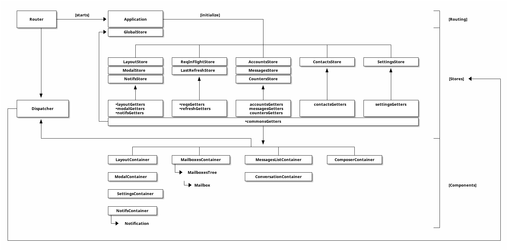

# Emails v2 : Frontend Specs

This document's about the refactoring of the frontend of the Cozy-Email app. By the time, we saw some glitches in our current v1 version (see the [legacy](#legacy) part of the document) which results to an inconsistent state of app, causing it complex to maintain, test, and evolve without introducing new issues.

We're strongly convinced that we need to rethink the base architecture of the app to stuck to a robust socle on which we can restart to add features and fix bugs in plain confidence. However, even if we probably need to rethink Ux paths too, we can keep current components by splitting and re-organizing them (see [components](#components) below), and keep a good part of the layouts.


## App structure

Application structure needs to drive how components interacts each with others to ensure separation of concerns is done right.



Application exposes several components, which helps to implement theflux design pattern:

- **Router**: responsible of routes handling and exposes a helper to generate routes from the current context. It also starts the application.
- **Application**: main entry point, it bootstrap components like _Stores_ and init the flux life-cycle
- **Stores**: each of them stores a part of the application state (see below)
- **Getters**: the set of helpers to let other application part answer the _Stores_ about their current state
- **Components**: there are 2 kind of components: _Containers_ which are top-level, Store-aware components and acts like _viewControllers_; and _Dumb_ components, which are just logic-less views that are responsible to the render of the passed-state. (figure above essentially list _only containers_).
- **Dispatcher** (and related _actions-creators_) that glue inputs (user/views actions, streams events, xhr responses, etc) to the _Stores actions_

### Stores

We define 10 stores that are responsible of the application state:

1. **GlobalStore**: handles the current root state of the application (e.g. fullscreen panes, drawer, etc), which aren't persisted, but just represent the global state
2. **ModalStore**: the _Store_ responsible of the modal dialog (i.e. who called it, to do what, with what message, etc). It represent the modal, its backdrop, if the modal is visible or not, its content, and the related actions
3. **NotifsStore**: handles the notifications stack (which also count for the _actions-creators_ alerts)
4. **ReqInFlightStore**: stores the current performed XHR requests and their status. It is also responsible to forward actions to the dispatcher when requests perform (with success or error). It's the reference for all remote actions, so it can serves as a log of all transactions to performs _undo_/_redo_/_rollback_… actions
5. **LastRefreshStore**: a _Store_ that knows which mailboxes refreshed and when. Useful for components who need to know exactly when did the last update occurs to update
6. **AccountsStore**: stores available accounts in the app and their metas (mailboxes, etc)
7. **MessagesStore**: stores the mailboxes messages in _Lists_
8. **CountersStore**: a dedicated _Store_ to the counters (e.g. read, unread, importants…) for mailboxes
9. **ContactsStore**: stores available _Contacts_
10. **SettingsStore**: application and per-account settings

We also use a temporary _Store_ which is here only to keep application consistent during the _Router_ refactor: the **LayoutStore**. It handles the current app layout state (i.e. which panes are displayed and where). After the _Router_ refactor, those panes states are implicit in the URL context (see the [routes](./routes.md) annex) and this _Store_'ll drop.

We have designed specific _Store_ for heavy-load processes like _last refresh_ status or _counters_ to prevent agressive reloads of some components.

### Getters

Getters isolate the methods to ask a _Store_ for its given state. This way, the _Store_ isn't responsible of _how_ its data is returned, it's only to stores and update it. At end, _Stores_ looks like:

```
state =
    _privateVar1

    _privateVar2


handle action, ->
    state._privateVar1 = value
```

Components use _Getters_ to ask _Stores_. This way:

- _Components_ and _Stores_ aren't tightly coupled
- _Stores_ are more clear and precise
- _Getters_ can be reused by multiple components who needs the same reduces actions (it's all about functions)
- _Getters_ used in multiple domain scopes can be distributed in a _commons<Domain>Getters_ part which simplifies maintenance

We can also use getters to _memoize_ some results and implement a cache strategy (see [Reactor Evaluate Getter Keypath](https://optimizely.github.io/nuclear-js/docs/07-api.html#-reactor-evaluate-getter-keypath-) and [Reselect](https://github.com/reactjs/reselect)), but keep in mind this can produces unwanted and complexified side effects, so **use it with caution**.

### Components

Components are separated in two parts:

- _Containers_: which are top-level, _Stores_-aware components that acts as a _ViewController_
- _Dumb_ atomic components, that are logic-less parts of the Ui and only serves to render the states passed by _Containers_

_Containers_ should be the only components that can interact with _Stores_. They ask them using _Getters_ for their states, and pass them to their _Dumb_ children _via_ props. It so makes a TreeView of components that is more efficient to traverse and maintain.


Note that, as well as we inherit from v1 legacy code for components, we don't rewrite each of them from scratch. Note also that we don't use JSX at this time, but as JSX brings well formatted _syntatic sugar_ and some magics upon React runtimes, it should be a clever choice to progressively migrate components to JSX as long as we rewrote / migrate / create components. It avoids us to create classes and factories just to let React use our components. It can be handled pretty well in our toolchain build given that webpack handles the different file formats for us.

### Router

Router is responsible of the application context given by the URL. It handles routes (see the [routes](./routes.md) annex) and trigger the right actions from its deduced context to updates _Stores_.

This way, each navigation actions in the application **should be a link**. By doing this, navigation link are catched by the router which `pushState` or `replaceState` URL in the navigator, and trigger a `ROUTE_CHANGED` dispatch event that's catched by related _Stores_.

Router is the first component initialized, and it bootstrap the application in its first state.

To be able to keep URLs consistent across the application, it exposes a `buildURL` helper which return a URL for a given endpoint depending of the current context.

In case of external events which causes a context change (e.g. a message deletion request success, so the current message change), as long as the context is handled by the `GlobalStore` (it listens to the request success and updates its `_currentMessage` value), this last is responsible to trigger the new URL in the router.


## Tests

Tests are complex and often source of errors, particularly when testing functionally the application. We should split tests in 3 parts:

1. Unit test _Stores_ and _Getters_: _Stores_ are responsible of how a data is persisted across application, components are only the results of this state. So we intensively unit test _Stores_ to ensure they stay consistent across changes. We also test _Getters_ if they're complex and we need to be certain that there results are the expected ones through their logics. We _don't_ test view components directly
2. Unit test _Router_: _Router_ can be a complex part, so we test it to be sure it properly react to the context changes that can occurs, and that the `buildURL` helper always returns a contextualized URL.
3. Functionally test application using a top-level tool like Casperjs, but only to keep valid scenarios and be sure that changes won't break user interactions. They're probably _not_ first level test, but more validation tests, written after implementation and here only to validate multiples scenarios after a pre-release build


## Best practices

Here are the best practices identified by the application maintainers to prevent
side effects and keep the codebase clean.

### Stores

- all _current_ state of application should be handled in the _GlobalStore_ as long as they only represent a given _state_, not a _data_
- use `Immutable.Records` for _data_ models
- use `Immutable.List` for lists (we can use `Immutable.OrderedMap` in cases where we want to keep tracks of ordered lists, but keep in mind this is done at a performance cost)
- use correct `PropTypes`, even with custom `PropTypes` (so defined them clearly)

### Components

- each time it's possible, prefer the use of a (even) small _dumb_ component rather than rely on `map`/`bind` in _container_. It lets the code more readable and concise, and prevent side effects
- Prefer to use [PureRenderMixin](https://facebook.github.io/react/docs/pure-render-mixin.html) which implements the `shouldComponentUpdate` hook based on the given props to re-render or not the components. As long as _dumb_ components are logic-less (_Pure Render_), it'll boost rendering performance
- this last also means _dumb_ components avoid `state` as possible to prevent side effects
- should use `key` to activate React performance cache busting, always on _Containers_ and as often as we can on list _dumb_ components
- Components never call external actions (remember, they're logic-less), like _Modals_. They instead trigger an actions listened by the _ModalStore_ which decides if the _modal_ should pop or not
- `getStateFromStore` should not embed any logic: the logic must be located in _getters_
- avoid the use of unnamed and bind functions inside components as they affects the call stack readability and the performance
- avoid to pass a huge number of `props`, prefer to pass a dedicated `Immutable.Map` from the _container_ instead to keep the props clean and concise

### Mixins

About _mixins_, we should use them to keep code more concise, but explicitly let
components that use them to know that the method come from a mixin (e.g. by prefixing functions with the mixin name).


## Server interactions

There's two kind of server interactions:

- **DS communication**: the request only involves the _Data System_ (to update messages, settings…)
- **IMAP communication**: the request rely upon a mail service protocol to perform its action

_Actions_ should represent each streamed data inside the application. So _actions-creators_ should _not_ implement callbacks in results to a previous actions (like requests handling) but must trigger a new action that reflect the new stream from the previous result. It keep code unidirectional and prevent side effects.

In case of server interactions, we should always implement the 3 _actions_ related to this change:

- `<remote_action>_REQUEST`: request is performed, waiting for the result
- `<remote_action>_SUCCESS`: request returns a `2xx` status
- `<remote_action>_FAILURE`: request returns a `4xx` or `5xx` status

### DS communication

In the case of remote actions that only implies the _data system_, we should use the [cozysdk-client](https://github.com/cozy/cozysdk-client) to performs the remote actions.

### Stateless server

To be compliant to the upcoming partnerships and have a scalable architecture on the server-side, we should enable a stateless server processes to handles main actions instead of storing them in RAM.

Doing this, each remote request on mail services actions will become triggers to processes, that runs on the side and then send back response to the realtime streamed socket. It so prevents to actions timeouts and let server decides of priorities and how to run actions in a async processed way.

The remote actions in _Dispatcher_ then introduces a 4th state `<remote_action>_PENDING` which can be triggered during requests in queue updates their status (e.g. progression, etc). The `SUCCESS` and `FAILURE` actions are triggered when the remote process finally ends and streams through realtime its final status.

### Mails server services

The email application server part should only contains routes that implies a mail protocol service action (IMAP, SMTP…). This way we can prepare the migration to a _DS Service_ for this kind of actions.

We can also updates server to mimic JMAP, that let use to use it when we decide to migrate to a _DS Service_.


## How to reach the v2?

To reach the V2 goal, we introduces changes step by step:

1. split the current _LayoutStore_ to: _layout_, _notifs_, _modal_ stores, and bring together _context_ states (the `_current<Key>`) to a _globalStore_
2. defines the new routes and adapt the router to serves those new routes (will probably be done in parallels with the stores split previous action)
3. isolate _Getters_ from the stores
4. clean _Actions_ to ensure stream communication is unidirectional
5. create _Container_ components that handles logics responsibilities
6. split components to _Dumb_ small components

In parallel, write tests to consolidate the new stores and getters.

Components and UX path will probably be redefined during this refactor. We can consider core plateform stable from the 5th point. The last one is here to optimize performance and keep code cleaner, it's also the right moment to enhance or redesign some part of the UX/Ui.
